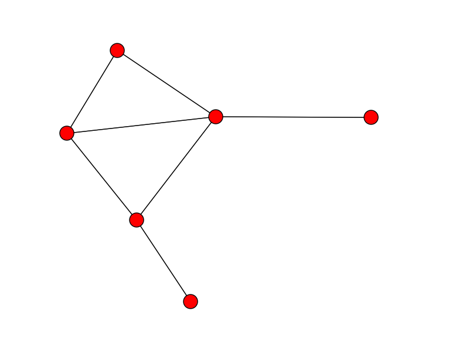
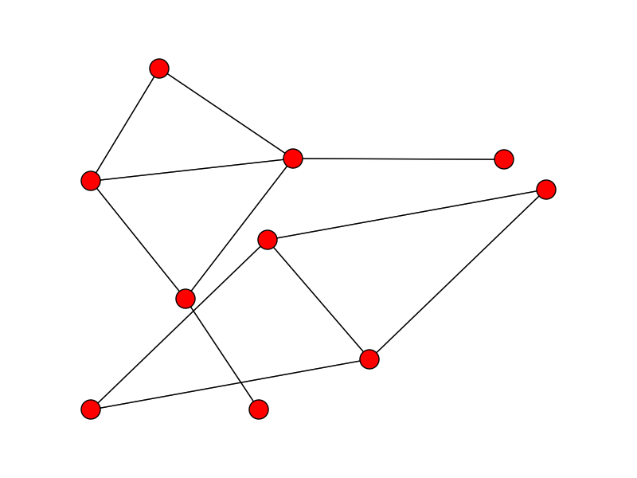

memo
========

## コンパイル時にやること

ex.

(col[1]=="hoge" and col[2]=="fuga" col[4]=="poyo") or (col[2]=="hogera" and col[5]=="piyo")

- とりあえず文字列一致、文字列比較、文字列のcontainだけをサポートする。
- 論理演算子はor/and/not

### 簡単化
- 1つ以上のAND節がORで結ばれたものに展開できる
- クワイン・マクラスキーのアルゴリズムを適用

### クエリコンパイル
- カラムの登録
- 各演算と、論理結合子からNFAを作成
- NFAをDFAに変換

ex.

NFA

DFA

### オートマトン作成のアルゴリズム
オートマトン
:    初期状態、受理状態、遷移表(現在の状態, インプットから次の状態を決定)を持つ。

カラム処理オートマトン
:    カラム、演算、検索文字列を持つ。カラムと値をインプットすると受理/非受理になる。

NOT
:    カラム処理オートマトンの受理・非受理を反転させた新しいオートマトンをつくる。

AND
:    2つのカラム処理オートマトンを受け取って新しいオートマトンを返す。カラムが小さい方の受理状態と大きい方の初期状態をつなぐ。

OR
:    2つのオートマトンを受け取って新しいオートマトンを返す。

## 実行時にやること

パースをしていく。カラム番号を管理する。登録されたカラム番号に遭遇したところで、DFAにインプットする。DFAが非受理確定になればパースをやめて次の行へ。

DFAが受理状態の時は、パースを実行し、結果を返す。

### 非受理を確定するアルゴリズム

選言肢が非受理状態になった時に削除。すべての選言肢が削除されれば非受理。

